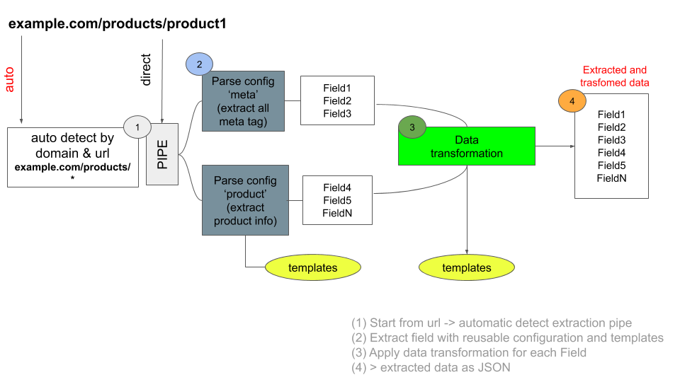

# scrapingless-parser

<h1>
  <br>
  <center>
  
  </center>
  <br>
  <br>
</h1>


> **API** ready to use to __parse and transform__ metadata from any HTML (using css selectors) and text. It works with **reusable** rules for extract fields and apply data transformation by JSON configurations.

## Table of Contents

- [Table of Contents](#table-of-contents)
- [Getting Started](#getting-started)
- [Start with Docker](#start-with-docker)
- [How it works](#how-it-works)
- [Multiple language support](#Multiple-language-support)
- [Templates](#templates)
- [Configuration example](#templates)

## Getting Started
This API provide a set of configurable rules to extract/parse data from any website, HTML or text without write any code but by using using a free "community" library extraction rules.

> Example: get html from example.com/products/product and parse calling scrapingless-parser API


```js
var url = "https://example.com/products/product";
var html = http.get(url, function(res) {
  ...
}

var autoParseUrl = "https://scrapingless-parser:3000/parse/auto?url=" + url;

var directParseUrl = "https://scrapingless-parser:3000/direct/ruleName=exampleProduct&version=1&url=" + url;

axios.post(autoParseUrl, {
    body: html
}).then(response =>
    //Json parsed data
    console.log(response.data)
);
```

## Start with docker


[View on Docker hub](https://hub.docker.com/repository/docker/scrapingless/scrapingless-parser)

```bash  
# Run in Docker
docker run -d -p 8080:3000 -v /my/own/datadir:/data scrapingless/scrapingless-parser:latest
```

- Map to port 8080  
- Mount your config directory to **data** path
  - "Config directory" is **the location** of your domains/parsing configurations


[CHECK WIKI DOCUMENTATION](https://github.com/scrapingless/scrapingless-parser/wiki)


---  


## How it works
> **AUTOPARSE**

Automatic parser feature is able to run parsing/extraction using a default pipe of rules by domain and url without specify which configuration use.

Auto-parser API works on 3 levels.  

1. Identify domain or website (example.com)  
2. Identify applicable rules by url (if url match /products/product* apply these rules).
3. Execute each parse rules and join all fields & for each field apply data transformation.

**_**Example**_**:

```markdown
Url is: **example.com/products/product1**

> If domain is example.com
   > If url match /products/* >
      > Extract all field defined in these rules:
          ['extract-head',
          'extract-product-detail',
          'text-summary',
          'product-reviews',
          ...]
      > For each field apply **data transformation** 
          [trim,
          if-Value-Then,
          subString,
          toArray,
          split,
          regex,
          ...
      ]
```

> **DIRECT**

Direct API call a specific set of rule **"pipe"**.  

1. Execute each parse rule of this pipe, join all fields & for each field apply data transformation.




## Multiple language support
Scrapingless-parser is an API and therefore can be used with any language or service.

- Javascript
- Python
- Java
- C#
- Php
- Go
- Swift

## Templates
Often in data parsing/extraction there are same pattern.
To facilitate less configuration writing it's possible to use templates for fields and data transformation.

> **Example**: extract the **second** word from a text

```"Apple Banana Orange"```


Instead or rewrite same rule each time it's possible create a template for e.g. called "secondWord" that split text and get index 1 (Banana).

[CHECK WIKI DOCUMENTATION](https://github.com/scrapingless/scrapingless-parser/wiki)

## Configuration example

#### **1. Domain**
Create in your "data" directory a folder with equals domain name and url-filter.json 

```bash

../data/example.com/url.filter.json

```

url-filter.json contain rules to apply fore all or Some url of "example.com" with regex expression.

**With AUTOPARSE**:

If url match "example.com/product/(.*)$" then run sequentially all rules defined

**With DIRECT**:
You can invoke a "pipe" (or a set of rules) by name+version of this domain ( ...?ruleName=productDemo&version=0.1 )

```json
{
    "urls": [
        {
            "regexes": [
                "example.com/product/(.*)$"
            ],
            "pipes": [
                {
                    "version" : 0.1,
                    "name": "productDemo",
                    "default": true,
                    "rules": [
                        "_commons/headBase",
                        "_commons/metaTagBasic",
                        "example.com/pruductDetails"
                    ]
                }
            ]
        }
    ]
}
```

#### **2. Define fields to extract**
Under .../data/example.com create a file pruductDetails.json.

This file define the fields to extract and all transformation rules to apply to each field.

In this example is defined a field "product/name" that extract data with css selector "#product-id" and apply a trasformation rule.

For e.g. if value extracted is equal to

"This is a product name , about tech"

The transformation rule apply split by "," and get first index "This is a product name " and then apply trim ""This is a product name".


```json
{
      "type": "basic",
      "name": "product/name",
      "selectors": ["#product-id"],
      "transform" : [
                {
                    "rule": "split",
                    "splitSeparator": ",",
                    "index": 1,
                    "onerror": {
                        "customVal": "99",
                        "type": "customVal"
                    },
                    "type": "getSingleIndex"
                },
                {
                    "rule" : "trim",
                    "type" : "both"
                }
                
            ]
      ]
    }
```

---

[CHECK WIKI DOCUMENTATION](https://github.com/scrapingless/scrapingless-parser/wiki)