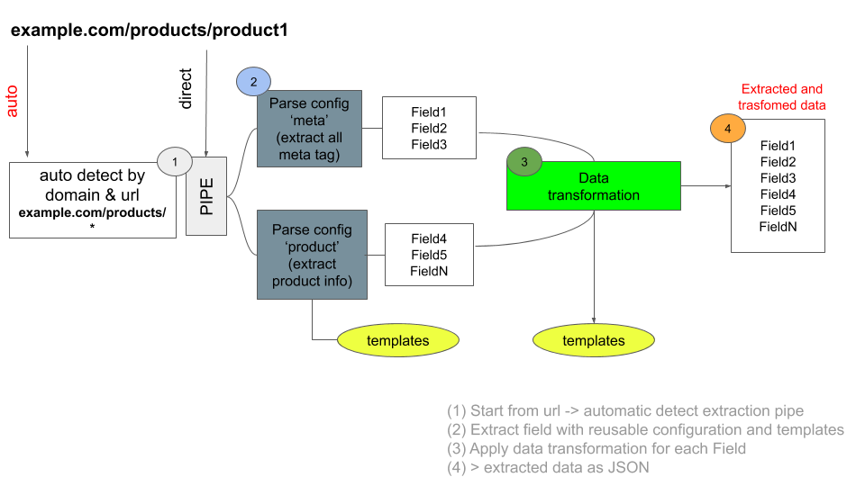

# scrapingless-parser
API for data extraction by reusable configuration

### Scraping (less)
The idea is to extract/parse data from HTML without rewrite same code each time using a "community" library of data extraction configurations.


### Example
Example: load html of example.com/products/product and parse calling scrapingless-parser API
```var options = ;

var url = "https://example.com/products/product"
var html = fetchHtml(url);

var apiUrl = "https://scrapingless-parser:3000/parse/auto?url=" + url;
axios.post(apiUrl, {   
    body: html
}).then(response => 
    //Json parsed data
    console.log(response.data)
  );
```


